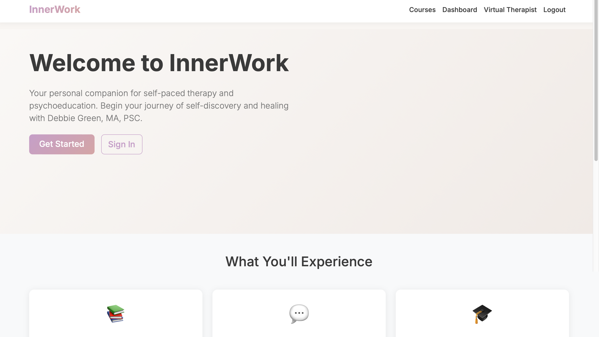
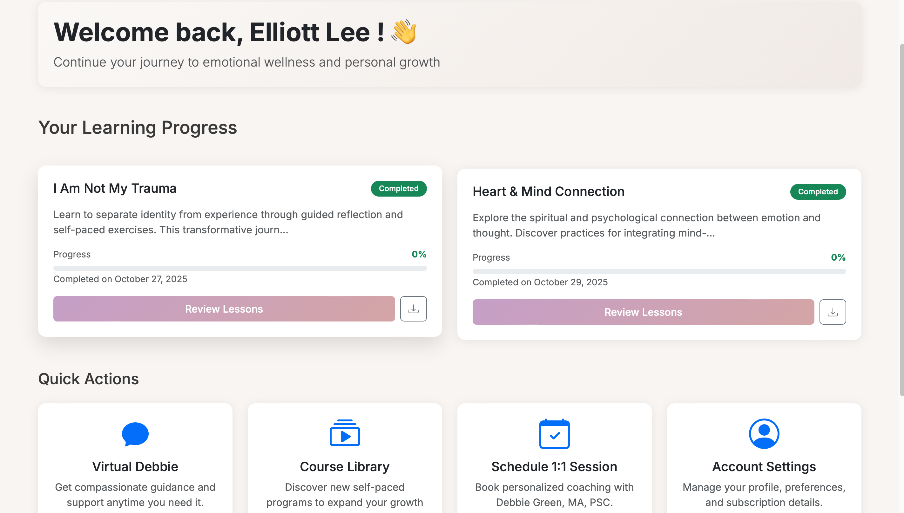
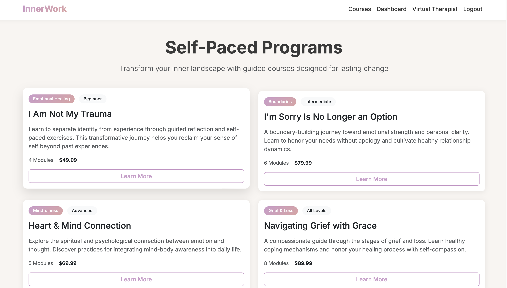
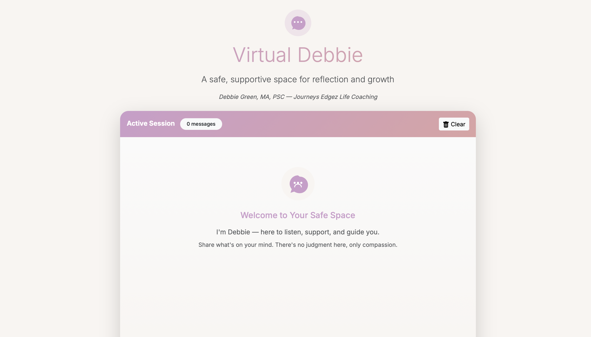

# 🧠 InnerWork – Guided Self-Development Web App  
*A personal reflection, journaling, and self-improvement app built with Flask.*

InnerWork is a lightweight mental wellness and journaling platform that guides users through reflection modules, prompts, and progress tracking. The project demonstrates practical Python, Flask, templating, routing, and UI development — built using a modern, AI-assisted development workflow. This app highlights my ability to take an idea from concept → architecture → working code.

## 🚀 Core Features  
• Guided self-development modules  
• Daily journaling + prompt-based reflection  
• User authentication (signup / login / sessions)  
• Dashboard with personalized progress  
• Clean UI using HTML/CSS templates  
• AI-assisted development using ChatGPT + Warp  
• Organized Flask blueprint structure  
• Deployment-ready with requirements + Procfile  

## 🛠 Tech Stack  
**Backend:** Python 3, Flask, Jinja2 templating, sessions & authentication  
**Frontend:** HTML5, CSS3, light JavaScript  
**Tools:** Git/GitHub, AI-assisted coding (ChatGPT, Warp), modular architecture  

## 📂 Project Structure  
innerwork/  
- app.py  
- requirements.txt  
- Procfile  
- routes/ (auth.py, dashboard.py, modules.py, __init__.py)  
- templates/ (base.html, index.html, login.html, register.html, dashboard.html, module_view.html)  
- static/ (styles.css, script.js)

## ▶️ Running the App Locally  
1. Clone the repository:  
git clone https://github.com/Elliott1985/innerwork.git  
cd innerwork  

2. Create and activate a virtual environment:  
python3 -m venv venv  
source venv/bin/activate (Mac/Linux)  
venv\Scripts\activate (Windows)  

3. Install dependencies:  
pip install -r requirements.txt  

4. Run the Flask server:  
python app.py  

Then open: http://127.0.0.1:5000

## 📸 Screenshots  
**Landing Page**  

**Dashboard**  

**Self-Paced Programs**  

**Virtual Debbie (Chat Interface)**  

## 👨‍💻 My Contributions  
I built this project end-to-end, including:  
• Designing the overall app architecture  
• Implementing all Flask routing, modules, and logic  
• Creating templates, UI flow, and layout  
• Integrating user authentication and session handling  
• Organizing the project using blueprint structure  
• Debugging and improving the app using Git/GitHub  
• Leveraging AI tools (ChatGPT + Warp) for rapid prototyping and refactoring  

## 📚 What I Learned  
• Practical Flask development  
• Building modular route structures  
• Template inheritance and layout reuse  
• Handling user sessions & authentication  
• Organizing code for readability and scaling  
• Implementing feature logic step-by-step  
• Using AI tools to accelerate development  
• Debugging backend and template issues  

## 🎯 Future Enhancements (Planned)  
• Stripe integration for paid premium content  
• OpenAI-powered reflective prompts  
• Saved journal history with export options  
• Dark mode UI  
• User profile customization  

## ⭐ Why This Project Matters  
InnerWork demonstrates real-world app development, backend and frontend skills, ability to learn and build quickly, and experience using AI-powered development workflows. It shows initiative, problem-solving, and readiness for entry-level roles in AI, automation, and Python-based development.
